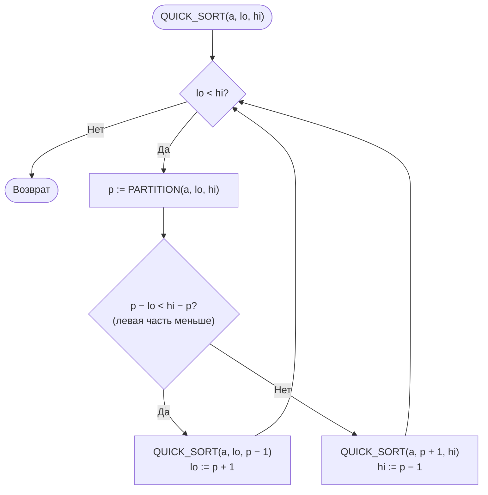
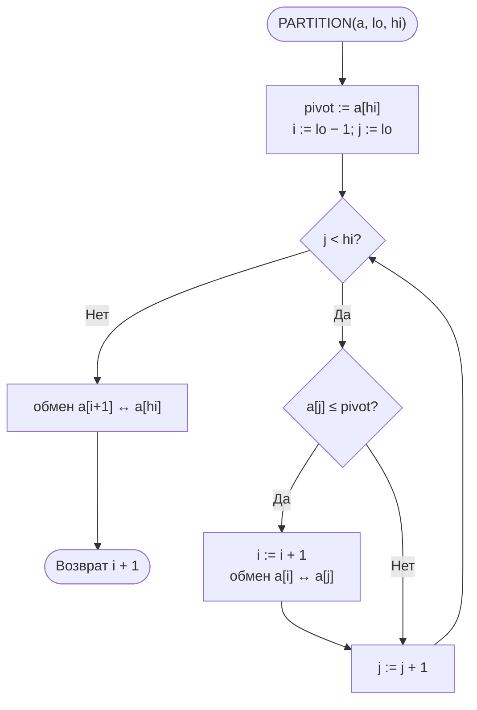
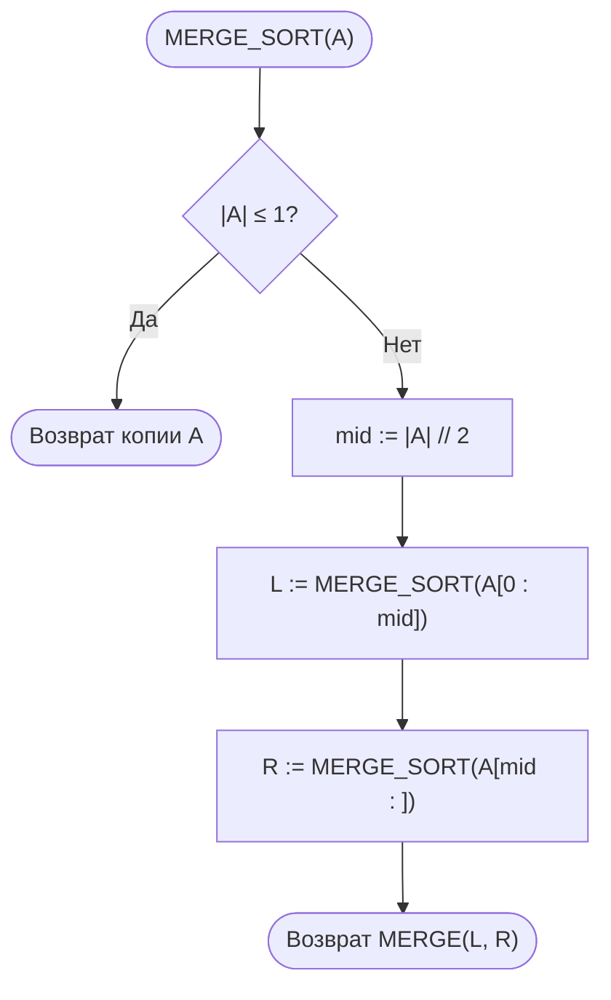
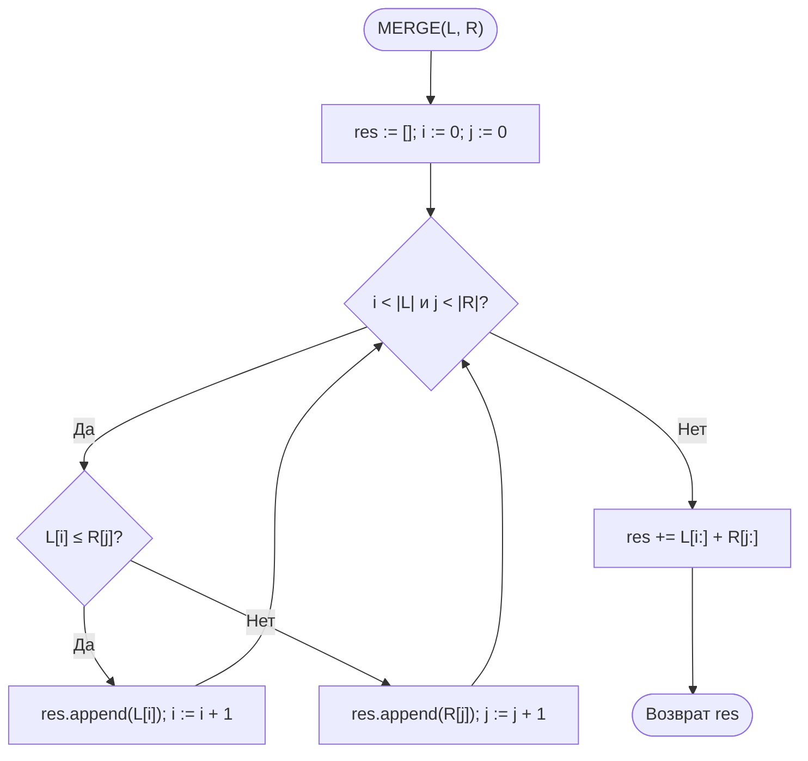

# Лабораторная работа № 3

## Эмпирический анализ временной сложности алгоритмов сортировки. Часть 2: алгоритмы на основе парадигмы «разделяй и властвуй» (быстрая сортировка и сортировка слиянием)

**Дисциплина:** Теория алгоритмов
**Направление подготовки:** 38.03.05 «Бизнес-информатика»
**Курс:** 2
**Объём:** 4 академических часа
**Вариант:** 14
**Язык реализации:** Python 3.10+
**Предварительные требования:** выполненная ЛР № 2 (функции `bubble_sort`, `insertion_sort`, модуль `sorts_common.py`)

---

## 1. Цель и задачи работы

**Цель работы:** изучить рекурсивные алгоритмы сортировки, построенные по принципу «разделяй и властвуй», экспериментально подтвердить их сложность $O(n \log n)$ и провести сравнительный анализ с квадратичными алгоритмами из ЛР № 2.

**Задачи:**

1. Изучить парадигму «разделяй и властвуй» и метод анализа рекуррентных соотношений.
2. Реализовать быструю сортировку (Quick Sort) и сортировку слиянием (Merge Sort) согласно варианту.
3. Сравнить четыре алгоритма (пузырьком, вставками, быструю, слиянием) на размерах из варианта ЛР № 2.
4. Сравнить быструю сортировку и сортировку слиянием между собой на больших массивах и на данных различной структуры, используя `sorted()` как эталон.
5. Исследовать влияние выбора опорного элемента на производительность быстрой сортировки.
6. Выполнить дополнительное задание **Г2** — подсчитать число сравнений и сопоставить его с $n\log_2 n$.

---

## 2. Задание своего варианта

**Исходные данные (вариант 14, табл. 2 методических указаний):**

| Параметр | Значение |
|---|---|
| Опорный элемент | **К** — последний (конечный) |
| Схема разбиения | **Л** — Ломуто |
| Сортировка слиянием | **Н** — нисходящая (рекурсивная) |
| Размеры $n$ для эксперимента 2 | 50 000; 75 000; 100 000; 125 000 |
| Дополнительное задание | **Г2** |

**Параметры экспериментов:**

| Эксперимент | Содержание | Данные | Повторов $k$ |
|---|---|---|---|
| 1 | Четыре алгоритма на размерах из варианта ЛР № 2: $n = 400, 800, 1200, 1600, 2000$ | 1а — случайные, $[-100;100]$; 1б — обратно упорядоченные (тип V из ЛР № 2), $[-100;100]$ | 7 |
| 2 | Быстрая, слиянием, `sorted()` на больших $n$ | случайные, $[0;100\,000]$ | 7 |
| 3 | Быстрая и слиянием на данных R, S, V, N, D | $n = 3000$ (см. ограничение ниже); дополнительно R и D при $n = 50\,000$ | 7 |

> **Ограничение эксперимента 3.** Поскольку в варианте опорным выбран **последний** элемент, на упорядоченных данных быстрая сортировка вырождается в $\Theta(n^2)$. Поэтому, согласно указаниям, эксперимент 3 на структурированных данных (S, V, N) выполнен при $n \le 3000$. Данные типа D (диапазон $[0;10]$) в этом варианте также проверены при $n = 3000$, а для случайных данных R и D дополнительно выполнен замер при $n = 50\,000$.

**Формулировка Г2:** подсчитать число сравнений в быстрой сортировке и сортировке слиянием, сравнить с величиной $n\log_2 n$, результаты оформить таблицей.

---

## 3. Теоретическая часть

### 3.1. Парадигма «разделяй и властвуй»

Решение задачи в три этапа: **разделение** на подзадачи меньшего размера, **властвование** (рекурсивное решение подзадач; малые решаются непосредственно — базовый случай) и **комбинирование** решений. Трудоёмкость описывается рекуррентностью

$$T(n) = a \cdot T\!\left(\frac{n}{b}\right) + f(n).$$

При $a=b=2$, $f(n)=\Theta(n)$ по основной теореме $T(n)=\Theta(n\log n)$: дерево рекурсии имеет $\approx\log_2 n$ уровней, на каждом суммарно выполняется $\Theta(n)$ операций.

### 3.2. Нижняя оценка для сортировок сравнением

Любая сортировка сравнением в худшем случае выполняет $\Omega(n\log n)$ сравнений: дерево решений должно иметь не менее $n!$ листьев, поэтому его высота не меньше $\log_2(n!) = \Theta(n\log n)$. Значит, сортировка слиянием асимптотически оптимальна.

### 3.3. Сортировка слиянием (нисходящая, Н)

- **Разделение:** массив делится пополам.
- **Властвование:** половины сортируются рекурсивно; массив из 0 или 1 элемента упорядочен.
- **Комбинирование:** две упорядоченные половины сливаются за $\Theta(n)$; нестрогое сравнение `left[i] <= right[j]` обеспечивает устойчивость.

```
MERGE-SORT(A)
1  if |A| ≤ 1
2      return A
3  mid = ⌊|A| / 2⌋
4  L = MERGE-SORT(A[1..mid])
5  R = MERGE-SORT(A[mid+1..n])
6  return MERGE(L, R)
```

Рекуррентность одинакова во **всех** случаях:

$$T(n) = 2T(n/2) + \Theta(n) \;\Rightarrow\; T(n) = \Theta(n\log n).$$

Недостаток — $\Theta(n)$ дополнительной памяти.

### 3.4. Быстрая сортировка: опорный — последний элемент, разбиение Ломуто

- **Разделение:** в качестве опорного берётся последний элемент $A[hi]$; один указатель $i$ отмечает границу «элементов, не больших опорного»; в конце опорный элемент ставится на своё окончательное место $p=i+1$.
- **Властвование:** рекурсивно сортируются $A[lo..p-1]$ и $A[p+1..hi]$.
- **Комбинирование:** не требуется (сортировка «на месте»).

```
PARTITION-LOMUTO(A, lo, hi)
1  pivot = A[hi]
2  i = lo − 1
3  for j = lo to hi − 1
4      if A[j] ≤ pivot
5          i = i + 1
6          обменять A[i] и A[j]
7  обменять A[i + 1] и A[hi]
8  return i + 1
```

**Оценки:**

- лучший и средний случаи: $T(n) = 2T(n/2)+\Theta(n) = \Theta(n\log n)$;
- худший случай: $T(n) = T(n-1)+\Theta(n) = \Theta(n^2)$.

**Почему выбор «последний» опасен.** Если массив уже упорядочен (по возрастанию или по убыванию), последний элемент оказывается **крайним** (наибольшим или наименьшим). Разбиение делит массив на части размеров $0$ и $n-1$; всего $n-1$ уровней рекурсии, на $k$-м из них выполняется $n-k$ сравнений, откуда $\sum_{k=1}^{n-1}(n-k)=n(n-1)/2$. Это в точности подтверждается в Г2 (табл. 8).

**Влияние повторяющихся ключей.** Схема Ломуто с условием `A[j] <= pivot` отправляет **все** элементы, равные опорному, в левую часть, поэтому на массивах с большим числом повторов разбиения несбалансированы: группа из $g$ равных элементов сортируется за $\Theta(g^2)$. Для данных типа D ($11$ различных значений, $g\approx n/11$) это даёт $\approx n^2/22$ сравнений.

**Глубина рекурсии.** В реализации рекурсивно обрабатывается **меньшая** часть, а большая — в цикле, поэтому глубина стека $O(\log n)$ даже в худшем случае. Без этого приёма на упорядоченных данных глубина достигла бы $n$, и Python завершился бы с `RecursionError` (лимит по умолчанию $\approx 1000$). С приёмом стек не переполняется, но время всё равно квадратично: цикл выполняется $n$ раз по $\Theta(n)$.

### 3.5. Сводная характеристика

| Алгоритм | Лучший | Средний | Худший | Доп. память | Устойчивость |
|---|---|---|---|---|---|
| Пузырьком | $\Theta(n)$ | $\Theta(n^2)$ | $\Theta(n^2)$ | $O(1)$ | Да |
| Вставками | $\Theta(n)$ | $\Theta(n^2)$ | $\Theta(n^2)$ | $O(1)$ | Да |
| Слиянием (Н) | $\Theta(n\log n)$ | $\Theta(n\log n)$ | $\Theta(n\log n)$ | $\Theta(n)$ | Да |
| Быстрая (К, Ломуто) | $\Theta(n\log n)$ | $\Theta(n\log n)$ | $\Theta(n^2)$ | $O(\log n)$ | Нет |
| Timsort (`sorted`) | $\Theta(n)$ | $\Theta(n\log n)$ | $\Theta(n\log n)$ | $O(n)$ | Да |

---

## 4. Блок-схемы алгоритмов

### 4.1. Быстрая сортировка



### 4.2. Разбиение Ломуто (опорный — последний элемент)



### 4.3. Сортировка слиянием (нисходящая) и слияние





### 4.4. Дерево рекурсии

Для сортировки слиянием при $n=8$: 4 уровня (размеры $8 \to 4+4 \to 2+2+2+2 \to 1\times 8$), на каждом уровне слияния суммарно $\Theta(n)$ операций, откуда $T(n)=\Theta(n\log_2 n)$. Для быстрой сортировки на **упорядоченном** массиве с опорным «последний» дерево вырождается в цепочку: размеры подзадач $n-1, n-2, \dots, 1$ (высота $n-1$), что даёт $\Theta(n^2)$.

---

## 5. Листинг программы

Модуль `lr3.py` (используются `sorts_common.py` и `lr2.py` из ЛР № 2):

```python
"""
Лабораторная работа № 3. Вариант 14.
Быстрая сортировка (опорный — последний элемент, разбиение Ломуто) и
нисходящая сортировка слиянием. Доп. задание Г2 — подсчёт сравнений.
"""
import math
from sorts_common import generate_data, measure
from lr2 import bubble_sort, insertion_sort


# ---------- Быстрая сортировка (Ломуто, опорный — последний) ----------
def quick_sort(arr):
    a = arr.copy()
    _quick_sort(a, 0, len(a) - 1)
    return a


def _quick_sort(a, lo, hi):
    while lo < hi:
        p = _partition(a, lo, hi)
        # рекурсия в меньшую часть — глубина стека O(log n)
        if p - lo < hi - p:
            _quick_sort(a, lo, p - 1)
            lo = p + 1
        else:
            _quick_sort(a, p + 1, hi)
            hi = p - 1


def _partition(a, lo, hi):
    """Разбиение Ломуто, опорный элемент — последний."""
    pivot = a[hi]
    i = lo - 1
    for j in range(lo, hi):
        if a[j] <= pivot:
            i += 1
            a[i], a[j] = a[j], a[i]
    a[i + 1], a[hi] = a[hi], a[i + 1]
    return i + 1


# ---------- Сортировка слиянием (нисходящая) ----------
def merge_sort(arr):
    if len(arr) <= 1:
        return arr.copy()
    mid = len(arr) // 2
    return _merge(merge_sort(arr[:mid]), merge_sort(arr[mid:]))


def _merge(left, right):
    result = []
    i = j = 0
    while i < len(left) and j < len(right):
        if left[i] <= right[j]:          # «<=» обеспечивает устойчивость
            result.append(left[i])
            i += 1
        else:
            result.append(right[j])
            j += 1
    result.extend(left[i:])
    result.extend(right[j:])
    return result


# ---------- Версии со счётчиком сравнений (Г2) ----------
def quick_sort_counted(arr):
    a = arr.copy()
    cnt = [0]

    def part(lo, hi):
        pivot = a[hi]
        i = lo - 1
        for j in range(lo, hi):
            cnt[0] += 1
            if a[j] <= pivot:
                i += 1
                a[i], a[j] = a[j], a[i]
        a[i + 1], a[hi] = a[hi], a[i + 1]
        return i + 1

    def qs(lo, hi):
        while lo < hi:
            p = part(lo, hi)
            if p - lo < hi - p:
                qs(lo, p - 1)
                lo = p + 1
            else:
                qs(p + 1, hi)
                hi = p - 1

    qs(0, len(a) - 1)
    return a, cnt[0]


def merge_sort_counted(arr):
    cnt = [0]

    def ms(x):
        if len(x) <= 1:
            return x.copy()
        mid = len(x) // 2
        left, right = ms(x[:mid]), ms(x[mid:])
        res = []
        i = j = 0
        while i < len(left) and j < len(right):
            cnt[0] += 1
            if left[i] <= right[j]:
                res.append(left[i]); i += 1
            else:
                res.append(right[j]); j += 1
        res.extend(left[i:]); res.extend(right[j:])
        return res

    return ms(arr), cnt[0]


# ---------- Эксперименты ----------
def run_experiment(algorithms, sizes, kind="random", repeats=7, lo=0, hi=100_000):
    results = {name: [] for name in algorithms}
    print(f"{'n':>8}" + "".join(f"{name:>12}" for name in algorithms))
    for n in sizes:
        data = generate_data(n, kind=kind, lo=lo, hi=hi)
        row = f"{n:>8}"
        for name, func in algorithms.items():
            t = measure(func, data, repeats)
            results[name].append(t)
            row += f"{t:>12.4f}"
        print(row)
    return results


if __name__ == "__main__":
    import matplotlib.pyplot as plt

    # Эксперимент 1: размеры из варианта ЛР № 2
    small = [400, 800, 1200, 1600, 2000]
    algs1 = {"Пузырьком": bubble_sort, "Вставками": insertion_sort,
             "Быстрая": quick_sort, "Слиянием": merge_sort}
    res1a = run_experiment(algs1, small, "random", 7, -100, 100)
    res1b = run_experiment(algs1, small, "reversed", 7, -100, 100)

    # Эксперимент 2: O(n log n) на больших размерах (вариант 14)
    large = [50_000, 75_000, 100_000, 125_000]
    res2 = run_experiment({"Быстрая": quick_sort, "Слиянием": merge_sort,
                           "sorted()": sorted}, large, "random", 7, 0, 100_000)

    # Эксперимент 3: влияние структуры данных (n = 3000 из-за опорного «последний»)
    print("\nЭксперимент 3, n = 3000")
    for label, kind, lo, hi in [("R", "random", 0, 100_000), ("S", "sorted", 0, 100_000),
                                ("V", "reversed", 0, 100_000),
                                ("N", "nearly_sorted", 0, 100_000), ("D", "random", 0, 10)]:
        data = generate_data(3000, kind=kind, lo=lo, hi=hi)
        print(f"{label:>3}: быстрая {measure(quick_sort, data, 7):.4f} с, "
              f"слиянием {measure(merge_sort, data, 7):.4f} с")

    # Г2: число сравнений
    print("\nГ2: число сравнений (случайные данные)")
    for n in large:
        data = generate_data(n, "random", 0, 100_000)
        _, cq = quick_sort_counted(data)
        _, cm = merge_sort_counted(data)
        nl = n * math.log2(n)
        print(f"{n:>8} {cq:>10} {cm:>10} {nl:>10.0f} {cq / nl:>6.2f} {cm / nl:>6.2f}")

    # Графики
    fig, axes = plt.subplots(1, 2, figsize=(12, 5))
    for name, t in res1a.items():
        axes[0].plot(small, t, marker="o", label=name)
    axes[0].set_yscale("log")
    axes[0].set_title("Эксперимент 1а (лог. шкала времени)")
    for name, t in res2.items():
        axes[1].plot(large, t, marker="o", label=name)
    axes[1].set_title("Эксперимент 2")
    for ax in axes:
        ax.set_xlabel("Размер массива n")
        ax.set_ylabel("Время, с")
        ax.grid(True)
        ax.legend()
    plt.tight_layout()
    plt.savefig("lr3_plot.png", dpi=150)
    plt.show()
```

---

## 6. Условия эксперимента

Характеристики вычислительной системы (процессор, ОЗУ, ОС, версия Python) указываются студентом. Приведённые значения получены в среде Linux, Python 3.12, медиана из 7 повторов (кроме отдельно оговорённых замеров). Измерения выполнялись на системе с фоновой нагрузкой, поэтому отдельные значения могут «шуметь» на 10–30 %; абсолютные времена на другой машине будут иными, но соотношения между алгоритмами и характер роста должны сохраниться. Данные генерируются с фиксированным `seed`; для экспериментов 2 и 3 диапазон значений задаётся явно.

---

## 7. Результаты экспериментов

### 7.1. Эксперимент 1а — четыре алгоритма, случайные данные $[-100;100]$, с

**Таблица 4.**

| $n$ | Пузырьком | Вставками | Быстрая | Слиянием |
|---|---|---|---|---|
| 400  | 0,00438 | 0,00158 | 0,00023 | 0,00039 |
| 800  | 0,01767 | 0,00685 | 0,00072 | 0,00112 |
| 1200 | 0,05637 | 0,01955 | 0,00133 | 0,00178 |
| 1600 | 0,08900 | 0,03586 | 0,00162 | 0,00196 |
| 2000 | 0,13734 | 0,03817 | 0,00192 | 0,00247 |

При $n = 2000$ быстрая сортировка опережает пузырьковую примерно в 71 раз, сортировку вставками — примерно в 20 раз; сортировка слиянием опережает пузырьковую в 56 раз. С ростом $n$ разрыв увеличивается.

### 7.2. Эксперимент 1б — те же алгоритмы на обратно упорядоченных данных (тип V из ЛР № 2), с

**Таблица 5.**

| $n$ | Пузырьком | Вставками | Быстрая | Слиянием |
|---|---|---|---|---|
| 400  | 0,00483 | 0,00281 | 0,00159 | 0,00031 |
| 800  | 0,02326 | 0,01369 | 0,00644 | 0,00064 |
| 1200 | 0,05184 | 0,03181 | 0,01323 | 0,00100 |
| 1600 | 0,07529 | 0,04382 | 0,01899 | 0,00102 |
| 2000 | 0,11564 | 0,06912 | 0,02835 | 0,00128 |

Здесь проявляется главная особенность варианта: **быстрая сортировка с опорным «последний» на обратно упорядоченных данных вырождается в квадратичную** — при росте $n$ в 5 раз (400 → 2000) время выросло в $\approx 17{,}8$ раза (для $n\log n$ ожидалось бы $\approx 6{,}4$, для $n^2$ — 25; отклонение от 25 объясняется повторами значений в диапазоне из 201 числа). При $n=2000$ быстрая сортировка **в 22 раза медленнее** сортировки слиянием (0,02835 против 0,00128 с), тогда как на случайных данных (табл. 4) она была быстрее слияния.

### 7.3. Эксперимент 2 — алгоритмы $O(n\log n)$ на больших массивах, случайные данные $[0;100\,000]$, с

**Таблица 6.**

| $n$ | Быстрая | Слиянием | `sorted()` | Слиянием / Быстрая | Быстрая / `sorted()` | Слиянием / `sorted()` |
|---|---|---|---|---|---|---|
| 50 000  | 0,0611 | 0,0817 | 0,0079 | 1,34 | 7,8 | 10,4 |
| 75 000  | 0,0930 | 0,1319 | 0,0123 | 1,42 | 7,6 | 10,7 |
| 100 000 | 0,1253 | 0,1797 | 0,0171 | 1,43 | 7,3 | 10,5 |
| 125 000 | 0,1513 | 0,2248 | 0,0224 | 1,49 | 6,7 | 10,0 |

**Таблица 7. Проверка роста времени.**

| Переход | Быстрая | Слиянием | Теория $O(n\log n)$ | Теория $O(n^2)$ |
|---|---|---|---|---|
| $50\,000 \to 75\,000$ (×1,5)  | 1,52 | 1,61 | $\approx 1{,}56$ | 2,25 |
| $75\,000 \to 100\,000$ (×1,33) | 1,35 | 1,36 | $\approx 1{,}37$ | 1,78 |
| $100\,000 \to 125\,000$ (×1,25) | 1,21 | 1,25 | $\approx 1{,}27$ | 1,56 |
| $50\,000 \to 100\,000$ (×2) | 2,05 | 2,20 | $\approx 2{,}13$ | 4,00 |

Теоретические значения вычислены по формуле

$$\frac{T(n_2)}{T(n_1)} \approx \frac{n_2\log n_2}{n_1\log n_1}.$$

Измеренные отношения практически совпадают с теоретическими для $n\log n$ и существенно отличаются от квадратичных.

### 7.4. Эксперимент 3 — влияние структуры данных, $n = 3000$, с

**Таблица 8.**

| Тип данных | Быстрая (К, Ломуто) | Слиянием | Быстрая / Слиянием |
|---|---|---|---|
| Случайные (R), $[0;100\,000]$ | 0,0022 | 0,0036 | 0,6 |
| Упорядоченные (S) | **0,2496** | 0,0024 | **104** |
| Обратно упорядоченные (V) | **0,1767** | 0,0024 | **74** |
| Почти упорядоченные (N) | 0,0054 | 0,0032 | 1,7 |
| Много повторов (D), $[0;10]$ | 0,0234 | 0,0033 | 7,1 |

**Дополнительно при $n = 50\,000$** (случайные и повторяющиеся данные):

| Тип данных | Быстрая | Слиянием | Примечание |
|---|---|---|---|
| Случайные (R) | 0,0482 | 0,0843 | $k=3$ |
| Много повторов (D), $[0;10]$ | **6,8401** | 0,0760 | быстрая: $k=1$ (долго); слиянием: $k=3$ |

**Подтверждение квадратичности на упорядоченных данных.** Быстрая сортировка на массиве S:

| $n$ | Время, с | Отношение к предыдущему | Теория $n^2$ |
|---|---|---|---|
| 1000 | 0,0273 | — | — |
| 2000 | 0,1106 | 4,05 | 4,00 |
| 3000 | 0,2528 | 2,29 | 2,25 |

Сортировка слиянием на тех же данных практически не чувствительна к структуре (0,0019–0,0036 с) — её сложность $\Theta(n\log n)$ во всех случаях.

### 7.5. Г2 — число сравнений

**Таблица 9. Случайные данные $[0;100\,000]$ (эксперимент 2).**

| $n$ | Быстрая | Слиянием | $n\log_2 n$ | Быстрая / $n\log_2 n$ | Слиянием / $n\log_2 n$ |
|---|---|---|---|---|---|
| 50 000  | 1 015 764 | 718 384   | 780 482   | 1,30 | 0,92 |
| 75 000  | 1 582 045 | 1 121 272 | 1 214 595 | 1,30 | 0,92 |
| 100 000 | 2 065 749 | 1 536 363 | 1 660 964 | 1,24 | 0,93 |
| 125 000 | 2 543 667 | 1 959 109 | 2 116 446 | 1,20 | 0,93 |

**Таблица 10. Худший случай быстрой сортировки (упорядоченные и обратно упорядоченные данные).**

| $n$ | Тип | Быстрая | $n(n-1)/2$ | Слиянием | $n\log_2 n$ |
|---|---|---|---|---|---|
| 1000 | S | 499 500   | 499 500   | 4 932  | 9 966  |
| 1000 | V | 495 514   | 499 500   | 5 048  | 9 966  |
| 2000 | S | 1 999 000 | 1 999 000 | 10 864 | 21 932 |
| 2000 | V | 1 975 860 | 1 999 000 | 11 101 | 21 932 |
| 3000 | S | 4 498 500 | 4 498 500 | 16 828 | 34 652 |
| 3000 | V | 4 432 578 | 4 498 500 | 18 098 | 34 652 |

**Комментарии.**

- Число сравнений сортировки слиянием составляет $\approx 0{,}92\text{–}0{,}93\cdot n\log_2 n$, что согласуется с теоретическим средним $\approx n\log_2 n - 1{,}25n$ (для $n=50\,000$: $780\,482-62\,500\approx 717\,982$ против измеренных $718\,384$).
- Быстрая сортировка на случайных данных выполняет $\approx 1{,}2\text{–}1{,}3\cdot n\log_2 n$ сравнений (теоретическое среднее для случайного массива — порядка $1{,}39\,n\log_2 n - O(n)$), то есть примерно на 30–40 % больше, чем слияние; при этом она выигрывает по времени за счёт более дешёвых операций (работа на месте, отсутствие выделения списков).
- На упорядоченных данных число сравнений быстрой сортировки **в точности равно** $n(n-1)/2$ (например, $499\,500$ при $n=1000$), в то время как слияние выполняет $\approx n\log_2 n/2$: разрыв в 100–130 раз при $n = 1000\text{–}3000$.

### 7.6. Сводная таблица

**Таблица 11. Итоговое сравнение ($n = 2000$, случайные данные $[-100;100]$, эксперимент 1а).**

| Алгоритм | Теор. сложность (средняя) | Время, с | Ускорение относительно пузырька | Память | Устойчивость |
|---|---|---|---|---|---|
| Пузырьком | $\Theta(n^2)$ | 0,13734 | 1 | $O(1)$ | Да |
| Вставками | $\Theta(n^2)$ | 0,03817 | 3,6 | $O(1)$ | Да |
| Слиянием | $\Theta(n\log n)$ | 0,00247 | 56 | $\Theta(n)$ | Да |
| Быстрая (К, Ломуто) | $\Theta(n\log n)$; худший $\Theta(n^2)$ | 0,00192 | 72 | $O(\log n)$ | Нет |

---

## 8. Выводы

1. Эксперимент подтвердил принципиальное различие классов сложности. При $n = 2000$ на случайных данных алгоритмы $O(n\log n)$ быстрее пузырьковой сортировки в 56–72 раза, а вставками — в 15–20 раз; на графике с логарифмической шкалой кривые квадратичных алгоритмов растут значительно круче.
2. Для быстрой сортировки и сортировки слиянием на случайных данных отношения $T(n_2)/T(n_1)$ (табл. 7) совпадают с теоретическими для $\Theta(n\log n)$: например, при удвоении $n$ (50 000 → 100 000) рост составил 2,05–2,20 при теоретических $\approx 2{,}13$ и квадратичных 4.
3. На случайных данных быстрая сортировка стабильно опережает сортировку слиянием в 1,3–1,5 раза: она работает на месте, не создаёт новых списков при каждом слиянии и имеет меньшую константу, хотя выполняет на 30–40 % больше сравнений (Г2). `sorted()` быстрее собственных реализаций в 7–8 раз (быстрая) и 10–11 раз (слияние) благодаря реализации на C и гибридному адаптивному алгоритму.
4. **Главный результат варианта 14 — деградация быстрой сортировки с опорным «последний» на структурированных данных.** На упорядоченных и обратно упорядоченных массивах разбиения Ломуто максимально несбалансированы (размеры $0$ и $n-1$), число сравнений равно ровно $n(n-1)/2$ (табл. 10), время растёт как $n^2$ (отношения 4,05 и 2,29 при теоретических 4,00 и 2,25) и при $n=3000$ быстрая сортировка оказывается в 74–104 раза медленнее слияния. Поэтому эксперимент 3 на таких данных проводился при $n \le 3000$: при $n = 50\,000$ потребовалось бы порядка $10^9$ сравнений (десятки секунд–минуты), а без приёма «рекурсия в меньшую часть» — ещё и глубина стека $\sim n$, приводящая к `RecursionError`.
5. Схема Ломуто с условием `<=` также деградирует на данных с **большим числом повторов** (тип D): при $n = 50\,000$ быстрая сортировка потратила 6,84 с против 0,076 с у слияния (в 90 раз дольше) и в 142 раза дольше, чем на случайных данных того же размера. Причина: все элементы, равные опорному, попадают в одну часть, и каждая группа равных элементов сортируется за квадратичное время ($\approx n^2/22$ сравнений для 11 значений). Сортировка слиянием от повторов не зависит.
6. **Рекомендации по выбору.** Для варианта 14 (опорный — последний, Ломуто) быстрая сортировка допустима только на заведомо неупорядоченных данных без большого числа повторов; для практики следует использовать средний, случайный или медиану трёх в качестве опорного и схему Хоара либо трёхпутевое разбиение. Если требуются устойчивость (многоуровневая сортировка отчётов) или гарантированное время $\Theta(n\log n)$ независимо от входа — следует выбирать сортировку слиянием. Для малых ($n<50$) или почти упорядоченных массивов подходит сортировка вставками. **В прикладных информационных системах следует использовать стандартные библиотечные средства** (`sorted()`), а собственные реализации оправданы лишь в учебных целях или при особых требованиях.

---

## 9. Ответы на контрольные вопросы

1. **Три этапа на примере сортировки слиянием.** *Разделение* — массив делится пополам за $O(1)$ (индексы) либо $\Theta(n)$ (срезы копируют данные). *Властвование* — обе половины сортируются рекурсивно; базовый случай — массив из 0 или 1 элемента. *Комбинирование* — две упорядоченные половины сливаются в один упорядоченный массив за $\Theta(n)$ двумя указателями.
2. **Рекуррентность:** $T(n)=2T(n/2)+cn$, $T(1)=c_0$. Дерево рекурсии: на уровне $k$ находится $2^k$ подзадач размера $n/2^k$, суммарная работа уровня $2^k\cdot c\,n/2^k=cn$; уровней $\log_2 n$, поэтому $T(n)=cn\log_2 n+c_0 n=\Theta(n\log n)$.
3. Дерево решений сортировки сравнением должно различать все $n!$ перестановок, поэтому имеет не менее $n!$ листьев; высота бинарного дерева с $L$ листьями не меньше $\log_2 L$, а $\log_2 n! = \Theta(n\log n)$ (по формуле Стирлинга). Высота дерева равна числу сравнений в худшем случае, следовательно, $\Omega(n\log n)$.
4. **Худшие данные для опорного «первый»:** упорядоченный или обратно упорядоченный массив (а при `<=`/`>=` — также массив из равных элементов). Первый элемент оказывается крайним (наименьшим или наибольшим), разбиение даёт части $0$ и $n-1$, $T(n)=T(n-1)+\Theta(n)=\Theta(n^2)$. В варианте 14 (опорный «последний») худшими являются те же данные, что подтверждено измерениями: $n(n-1)/2$ сравнений и время $\approx 0{,}25$ с при $n=3000$.
5. **Ломуто:** один указатель $i$ (граница «$\le$ опорного»), просмотр слева направо, опорный — как правило, последний, опорный элемент в конце ставится на окончательное место; проще, но больше обменов и деградация на повторяющихся ключах. **Хоара:** два указателя движутся навстречу друг другу, обмениваются найденные «неправильно расположенные» элементы; в среднем примерно втрое меньше обменов и лучшая сбалансированность при повторах, но опорный не обязательно оказывается на окончательном месте, а реализация тоньше (риск зацикливания при неудачном выборе опорного).
6. При случайном выборе опорного элемента вероятность получить крайний элемент на каждом шаге равна $2/(hi-lo+1)$; ни одна конкретная входная последовательность не является «плохой» заранее, а математическое ожидание времени равно $\Theta(n\log n)$ для **любых** входных данных. Злоумышленник или неудачная структура данных (упорядоченность) не могут спровоцировать худший случай, не зная последовательности случайных чисел.
7. Быстрая сортировка работает на месте (нет выделения списков и копирования, как при слиянии), хорошо использует кэш процессора (последовательный доступ к памяти), имеет меньшую константу в $\Theta(n\log n)$; вероятность худшего случая при хорошем выборе опорного пренебрежимо мала. В наших измерениях на случайных данных она в 1,3–1,5 раза быстрее слияния, несмотря на большее число сравнений (1,2–1,3 против 0,92 от $n\log_2 n$). Но при **неудачном** выборе опорного (вариант 14 на упорядоченных данных) проигрыш составляет уже 74–104 раза.
8. Приём: рекурсивно обрабатывать **меньшую** из двух частей, а большую — в цикле (хвостовая рекурсия исключается). Меньшая часть имеет размер не более $n/2$, поэтому глубина стека не превышает $\log_2 n$.
9. **Слияние** устойчиво: при равенстве ключей (`left[i] <= right[j]`) первым берётся элемент из левой (более ранней) половины, поэтому взаимный порядок равных элементов сохраняется. **Быстрая сортировка** неустойчива: обмены элементов через большие расстояния (в Ломуто — `a[i] ↔ a[j]`, при постановке опорного `a[i+1] ↔ a[hi]`) могут «перепрыгнуть» равный элемент и изменить порядок равных ключей.
10. **Идеи Timsort:** выделение в данных естественных упорядоченных участков (*runs*), доведение коротких участков до минимальной длины сортировкой вставками и их слияние с помощью стека с инвариантами, обеспечивающими сбалансированность слияний; режим «galloping» для ускорения слияния, когда один участок «выигрывает» многократно подряд. Сортировка вставками используется для коротких подмассивов, потому что при малых $n$ у неё малая константа (нет накладных расходов рекурсии и выделения памяти), она работает на месте, устойчива и на почти упорядоченных данных близка к линейной.
11. Для 10 млн транзакций, не помещающихся в оперативную память, следует выбрать **внешнюю сортировку слиянием**: файл читается блоками, помещающимися в память; каждый блок сортируется во внутренней памяти (например, `sorted()`) и записывается на диск как упорядоченный «прогон»; затем прогоны сливаются $k$-путевым слиянием (с помощью кучи) за один или несколько проходов. Слияние подходит потому, что читает и пишет данные строго последовательно, а не случайным образом, как быстрая сортировка.

---

## 10. Рекомендуемая литература

1. Кормен Т., Лейзерсон Ч., Ривест Р., Штайн К. Алгоритмы: построение и анализ. — 3-е изд. — М.: Вильямс, 2013. — Гл. 2, 4, 7, 8.
2. Седжвик Р., Уэйн К. Алгоритмы на Java. — 4-е изд. — М.: Вильямс, 2013. — Гл. 2.
3. Hoare C. A. R. Quicksort // The Computer Journal. — 1962. — Vol. 5, No. 1. — P. 10–16.
4. Скиена С. Алгоритмы. Руководство по разработке. — 3-е изд. — СПб.: БХВ-Петербург, 2022.
5. Кнут Д. Э. Искусство программирования. Т. 3. Сортировка и поиск. — 2-е изд. — М.: Вильямс, 2017.
6. Бхаргава А. Грокаем алгоритмы. — 2-е изд. — СПб.: Питер, 2024. — Гл. 4.
7. Рафгарден Т. Совершенный алгоритм. Основы. — СПб.: Питер, 2019.
8. Peters T. Timsort description (listsort.txt) [Электронный ресурс]. — URL: https://github.com/python/cpython/blob/main/Objects/listsort.txt
